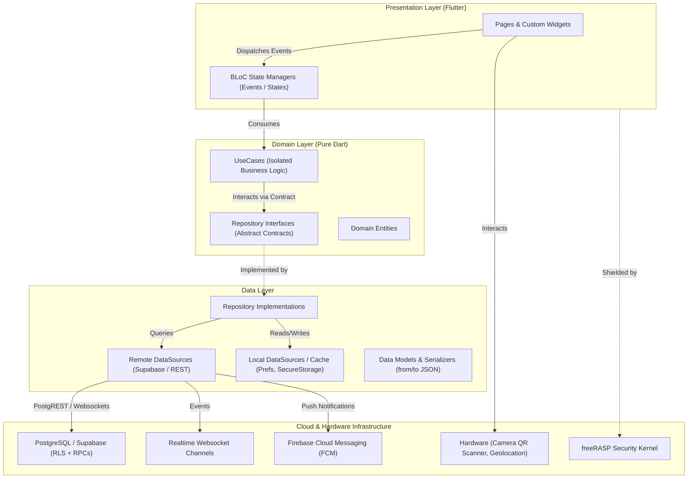

# SAMO — Sports League, Club Management & Enterprise POS Ecosystem

<div align="center">


<br/>

**A mission-critical, enterprise-grade multiplatform ecosystem designed for real-time sports league matchmaking, dynamic ELO rankings, automated tournament management, club court reservations, and a high-concurrency Point of Sale (POS) & ERP subsystem.**

<sub>*Note: This repository serves as a public architectural showcase and technical case study. Proprietary business algorithms, backend secrets, and commercial assets are private and protected.*</sub>

---

</div>

## Table of Contents
- [Executive Overview](#executive-overview)
- [System Architecture and Design Patterns](#system-architecture-and-design-patterns)
- [Core Engineering Highlights](#core-engineering-highlights)
  - [1. Real-Time Concurrency and ACID Integrity (PostgreSQL RPCs)](#1-real-time-concurrency-and-acid-integrity-postgresql-rpcs)
  - [2. Elimination of N+1 Query Anti-Pattern](#2-elimination-of-n1-query-anti-pattern)
  - [3. Enterprise POS and Financial Reconciliation Engine](#3-enterprise-pos-and-financial-reconciliation-engine)
  - [4. Tournament Engine and Bracket Generation](#4-tournament-engine-and-bracket-generation)
  - [5. Dynamic ELO and League Points (LP) Matchmaking](#5-dynamic-elo-and-league-points-lp-matchmaking)
  - [6. DevSecOps: Mobile App Hardening (RASP) and Multi-Tenant RLS](#6-devsecops-mobile-app-hardening-rasp-and-multi-tenant-rls)
- [Architectural Blueprint](#architectural-blueprint)
- [Tech Stack and Dependencies](#tech-stack-and-dependencies)
- [Quality Assurance and Testing Strategy](#quality-assurance-and-testing-strategy)
- [Author and Engineering Inquiries](#author-and-engineering-inquiries)

---

## Executive Overview

**SAMO** is a unified multiplatform solution that bridges the gap between competitive sports players and sports facility administrators. The platform addresses two core engineering domains:

1. **High-Engagement Player and League Experience:** Real-time court bookings, open-match matchmaking, dynamic ELO-based ladder rankings, consensus-driven score voting, and automated multi-stage tournament brackets.
2. **Mission-Critical Club Operations (ERP / POS):** Robust multi-terminal Point of Sale system, real-time cashier shift management with blind cash reconciliation, split payments (Cash, Cards, Digital Wallets, App Bypass), barcode/QR optical hardware integration, loss/shrinkage tracking, and asynchronous financial report streaming.

```
+------------------------------------------------------------------------+
|                             SAMO ECOSYSTEM                             |
+----------------------------------+-------------------------------------+
|      CUSTOMER / PLAYER APP       |     ADMINISTRATION / CLUB ERP       |
|  - Dynamic ELO & League Points   |  - High-Concurrency POS System      |
|  - Automated Tournament Brackets |  - Cash Register Shift Tracking     |
|  - Real-Time Court Reservations  |  - Split Payments & App Bypass      |
|  - Optical QR Verification       |  - Inventory, Mermas & Adjustments  |
|  - Multi-Sport Theming Engine    |  - Bulk Financial Reporting & Export|
+----------------------------------+-------------------------------------+
```

---

## System Architecture and Design Patterns

The codebase strictly adheres to **Clean Architecture** combined with **Domain-Driven Design (DDD)** and the **BLoC (Business Logic Component)** pattern, ensuring 100% decoupling between UI layers and data sources.



### Key Architectural Tenets
- **Strict Unidirectional Data Flow:** `Page Event -> BLoC -> UseCase -> Repository -> DataSource -> PostgreSQL`.
- **Functional Error Handling:** Zero untyped try/catch leaks in UI. All repositories return `Either<Failure, T>` using functional algebraic types (`dartz`), enforcing deterministic compile-time error handling.
- **Dependency Injection:** Centralized service locator (`GetIt`) registering lazy singletons for data sources, repositories, and factories for state managers.
- **Dynamic Multi-Tenant and Multi-Sport Theming:** Decoupled design tokens allowing runtime theme and accent injection depending on the active discipline (Padel, Football, Basketball, Tennis, Pickleball).

---

## Core Engineering Highlights

### 1. Real-Time Concurrency and ACID Integrity (PostgreSQL RPCs)
- **Problem:** In high-traffic scenarios, concurrent users could attempt to book the same court slot simultaneously, or concurrent POS terminals could read stale register balances, resulting in race conditions and double-allocations.
- **Solution:** Replaced client-side multi-query operations with **atomic stored procedures (PL/pgSQL RPCs)** executed directly within PostgreSQL transactions with explicit row-level locks:
  - `update_shift_expected_balance()`: Atomically updates cashier cash-in-hand without lost updates.
  - `join_open_match()` and `book_court_slot()`: Executes conditional lock checks to guarantee mutual exclusion in slot assignment.

### 2. Elimination of N+1 Query Anti-Pattern
- **Problem:** Loading monthly financial statements originally triggered independent queries for each day's transactions, causing excessive network overhead, database latency, and UI degradation.
- **Solution:** Re-engineered the retrieval pipeline to perform **3 vectorized bulk queries** for the entire date range, streaming the raw dataset and performing date-grouping, filtering, and mathematical balance operations in-memory within Dart isolates.

### 3. Enterprise POS and Financial Reconciliation Engine
- **Multi-Modal Split Payments:** Dynamic payment engine capable of splitting single tickets across multiple payment methods simultaneously (Cash, Debit/Credit Card, Nequi/Digital Wallet, In-App Account Bypass).
- **Blind Cash Counting and Shift Auditing:** Automated expected balance calculation based on real recorded ledger transactions versus cashier physical count, preventing cash shrinkage.
- **Hardware Optical Integration:** Real-time barcode and QR code reading integrated via camera streams (`mobile_scanner`) with haptic feedback.
- **Report Streaming:** Asynchronous generation and file saving of structured **Excel (.xlsx)** and **CSV** reports directly from client devices.

### 4. Tournament Engine and Bracket Generation
- **Mathematical Bracket Generator:** Automated recursive generator supporting Single Elimination, Double Elimination, Round Robin, and "Americano" mixed rotation formats.
- **Drag-and-Drop Manual Seeding:** Interactive visual canvas allowing tournament organizers to manually re-seed players and teams before finalizing bracket generation.
- **Consensus-Based Dispute Resolution:** Multi-party match result voting system with automatic validation triggers when both sides confirm scores.

### 5. Dynamic ELO and League Points (LP) Matchmaking
- Mathematical ranking algorithm adapting standard chess ELO principles for doubles/singles racquet sports:
  $$\Delta R = K \cdot (S - E)$$
- Includes tier divisions (Bronze, Silver, Gold, Diamond, Master), placement match weighting, inactivity decay, and promotion/relegation thresholds.

### 6. DevSecOps: Mobile App Hardening (RASP) and Multi-Tenant RLS
- **Runtime Application Self-Protection (RASP):** Integrated `freeRASP` at the binary level to detect and mitigate:
  - Rooted / Jailbroken environments.
  - Reverse-engineering hooks (Frida, Xposed).
  - Emulator execution and repackaging/tampering signatures.
- **Row-Level Security (RLS):** 100% of PostgreSQL tables protected by granular security policies, enforcing strict tenant isolation so clubs and players can only mutate authorized records.
- **Environment Secret Isolation:** Strict encapsulation of runtime credentials using `.env` configurations injected via `flutter_dotenv`.

---

## Tech Stack and Dependencies

| Category | Technology / Package | Purpose |
|---|---|---|
| **Core Framework** | `Flutter 3.9.2+` & `Dart` | Cross-platform runtime (Android, iOS, Web) |
| **State Management** | `flutter_bloc` & `equatable` | Unidirectional reactive state orchestration |
| **Architecture** | `get_it`, `dartz` | Dependency injection & functional error handling (`Either`) |
| **Backend & Database** | `supabase_flutter` (PostgreSQL) | Auth, Storage, Realtime subscriptions, RPCs |
| **Security** | `freerasp`, `flutter_dotenv` | Binary RASP, anti-hooking & secret encapsulation |
| **Authentication** | `google_sign_in`, `sign_in_with_apple` | Native OAuth2 federated authentication |
| **Push Notifications** | `firebase_messaging`, `flutter_local_notifications` | Push messaging (FCM) & local foreground triggers |
| **Deep Linking** | `app_links` | Dynamic universal & custom-scheme deep links |
| **Hardware & Sensors** | `mobile_scanner`, `geolocator`, `image_cropper` | QR reading, GPS positioning, image manipulation |
| **Mapping** | `flutter_map`, `latlong2` | Vector OpenStreetMap visualization & geofencing |
| **Data Export** | `excel`, `csv`, `file_saver` | Client-side spreadsheet generation and export |
| **Testing** | `golden_toolkit`, `bloc_test`, `mocktail` | Visual regression, BLoC and unit testing suites |

---

## Quality Assurance and Testing Strategy

```
  +---------------------------------------------------------+
  |                    INTEGRATION TESTS                    |
  |    End-to-End user journeys: Booking, Auth, POS flow   |
  +---------------------------------------------------------+
  |                   GOLDEN UI TESTS                       |
  |   Pixel-perfect visual regression on multiple viewports |
  +---------------------------------------------------------+
  |                 BLoC & USE CASE TESTS                   |
  |   Deterministic state transition testing (bloc_test)    |
  +---------------------------------------------------------+
  |                   UNIT & MODEL TESTS                    |
  |   Serialization, ELO math, bracket algorithms (pure)    |
  +---------------------------------------------------------+
```

The system employs a strict multi-tier testing pyramid:
1. **Unit and Math Testing:** Deterministic pure function verification (ELO calculation, bracket generation, financial rounding).
2. **BLoC State Testing:** Event-to-state stream transitions under mocked failure/success conditions using `bloc_test` and `mocktail`.
3. **Golden Visual Regression:** Automated snapshots preserving pixel-level consistency across multiple screen resolutions.
4. **Static Code Analysis:** Strict linting rules enforced via `flutter_lints` and `analysis_options.yaml`.

---

## Author and Engineering Inquiries

Developed and architected by **Nicolás León** — Systems Engineer & Software Architect.

- **LinkedIn:** [linkedin.com/in/nicolas-leon](https://linkedin.com)
- **GitHub:** [github.com/Nicolas11Leon](https://github.com/Nicolas11Leon)
- **Contact:** Software Architecture & Systems Engineering Consulting

---

<div align="center">
  <sub>Built with precision, Clean Architecture, and engineering rigor. Copyright 2026 SAMO Ecosystem.</sub>
</div>
